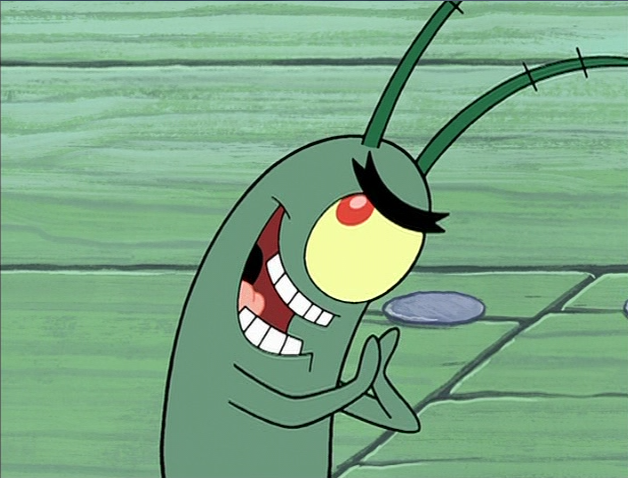

class: middle, center

# Reasoning

--

>  the action of thinking about something in a logical, sensible way

---

class: middle, center

# Prediction

--

>  Is a statement about an event that has yet to pass

---

class: middle, center

# Decision

--

>  a conclusion or resolution reached after consideration.

---

class: middle, center

# What connects these three? 

--

1. **Reasoning** forms _mental models_

--

2. _Mental models_ form the _foundations_ of **predictions** and **decisions**

---

class: middle, center

# Why is Reasoning important?

--

> The better the reasoning the better the  models, the better foundation one has for making decisions/predictions

---

# Examples of reasoning

---

class: middle, center

name: example1

* **All men are mortal**

--

* ** Socrates is a man **

--

* ** CONCLUSION :: Socrates is mortal **

---

class: middle, center

* **If today is tuesday, John will go to work**

--

* **Today is tuesday**

--

* **CONLUSION :: John will go to work **

---

class: middle, center

# The Pattern of the previous examples

--

1. I gave you a conditional/generalized (albeit hidden) statement  which I told you is true

--

2. Took a specific example that satisfied the conditional 

--

3. Derived a conclusion

---

class: middle, center

# Deductive Reasoning

---

class: middle, center

# Deductive Reasoning

--

> There has to be a  general rule somewhere in argument

--

> **example** -> _All men are mortal_, _John goes to work every tuesday_

---

class: middle, center

# Deductive reasoning guarantee

--

> Given all the premises are true combined with rules of deductive reasoning, then the conclusion is true

---

class: middle, center

* **Harold is a grand-father**

--

* **Harold is bald**

--

* **CONCLUSION :: All grand-fathers are bald**

---

class: middle, center

# The Wrongs

--

1. The conclusion is wrong

--

2. None of the arguments is a general rule

---

class: middle, center

* **Harold is a grand-father** (specific)

--

* **Harold is bald** (specific)

--

* **CONCLUSION :: All grand-fathers are bald**  (General)

---

class: middle, center

### The reasoning is trying to go from specific to general

---

class: middle, center

### Another Example

--

* You are a Police officer

--

* You are patrolling out late

--

* You come across the following

---

class: middle, center

1. A Jewelery shop with a huge glass window

--

2. The in-store alarm is ringing

--

3. The glass window is broken

--

4. A person dressed in black clothes is crawling out of the  broken window

--

5. A person is holding a sack which turns out to be full of jewelry

--

6. **Conclusion** ????????????????????????????

---

class: middle, center

### Is there a similarity between the grandfather example and this example?

---

class: middle, center

### Programming a Robot

> given the same list of observations, would you program the robot to always arrest the person?

---

class: middle, center

### Is there a definite conclusion one can arrive at?

---

class: middle, center

### A situation where the person is not guilty?

---

class: middle, center

### The previous two examples are not deductive reasoning examples

---

class: middle, center

### Inductive reasoning

--

1. the arguments made here supplies evidence for the truth of a conclusion

--

2. the conclusion is probable and never likely correct in all scenarios

 
---

class: middle, center

### Deductive vs Inductive Reasoning

--

1. Deductive goes from general to specific (Top-Down)

--

2. Inductive goes from specific to general (bottom-up)

--

3. Deductive reasoning is when you apply an existing theory to predict the outcome of  situation

--

4. Inductive reasoning is when you gather evidence to make up a theory

---

class: middle, center

### Topic in Focus: Darling of inductive thinking

---

class: middle, center

# Probabilistic reasoning

--

>  The modern way to arrive at a strongly plausible conclusion (that could possibly be wrong) given
  a crap-ton of uncertain information or a mind-boggingly small amount of information

---

---

class: middle, center

### The Monty Hall Problem Description

--

1. You are in a game show

--

2. You are shown three closed doors 

--

3. Behind one of those closed doors is a car

--

4. The rest of the doors hide a  goat each

--

5. You tell the game host you think door 1 is the car door

--

6. The game host opens door 3 and reveals a goat behind it

--

7. The game host turns to you and asks you ......

---

class: middle, center

## Do you want to switch doors ?

---

class: middle, center

# The Monty Hall Problem 

--

* This puzzle stumped a lot of people

--

* The solution to this problem stumped a lot of people

--

* Allegedly a lot of Math PhDs got this problem wrong

--

* Best of all, the solution stumped this guy ....

---

class: middle, center

---

class: middle, center

## Paul Erdos

--

1. Big time Mathematician

--

2. More like one of the best mathematicians of all time

--

3. So prolific, the mathematicial equivalent of the Bacon number is the Erdos Number

---

class: middle, center

### The road to the Monty Hall Problem solution

--

1. The easy way

--

2. The hard way 

---

class: middle, center

###  Guess which one I'm taking?

---

class: middle, center

# Solving the Monty Hall Problem using probability theory

--

### weapon of choice: Bayes theorem

---

class: middle, center

### What is Probability?

--

- Intuitively, it is a measure of one's belief that an event will occur

--

- This is always a number either expressed as a percentage or a real number from 0 to 1

---

class: middle, center

### Few more definitions to get out of the way

---

class: middle, center

### Random experiment

--

> The setup within which events of interest occur

--

> **examples:**  tossing a coin, shuffling cards, people undergoing medical trials, gameshow

---

class: middle, center

### Sample Space (very very important)

--

> When you list all the outcomes of a random experiment, you get a sample space 

---

class: middle, center

### Sample Space Examples (very very important)

--

1. Coin toss : `[heads, tails]`

--

2. Single Dice Roll: `[1,2,3,4,5,6]`

--

3. Double Dice Roll: `[(1,1),(1,2),(1,3) .. (1,6), (2,1) ... (2,6) ..... (6,1)...(6,6)]`

--

4. random card draw (only interested in the suite): `[Diamond, Clubs, Spade, Hearts]`

--

5. Monty Hall Problem `[(Goat, Goat, Car), (Goat, Car, Goat), (Car, Goat, Goat)]`

---

class: middle, center

### Probability formula

--

(count of _favourable outcomes_)/(total count of _sample space_)

---

class: middle, center

### Examples whose answer you are implicitly aware of

--

* What is the probability of landing a heads on a fair coin toss?

--

* **Answer** 50%

--

* Probability of landing a 2 on a dice roll?

--

* **Answer** 0.16666%

--

* Probability of car being behind one of the three doors in the monty hall problem?

--

* **Answer** 0.33333 %

---

class: middle, center

### Back to the Monty Hall Problem

---

class: middle, center

### The Monty Hall Problem Description

--

1. You are in a game show

--

2. You are shown three closed doors 

--

3. Behind one of those closed doors is a car

--

4. The rest of the doors hide a  goat each

--

5. You tell the game host you think door 1 is the car door

--

6. The game host opens door 3 and reveals a goat behind it

--

7. The game host turns to you and asks you ......

---

class: middle, center

## Do you want to switch doors ?

---

class: middle, center

### The things that apply to the game host

--

1. **He knows which door is the winning door**

--

2. **After you've chosen a door, he can ONLY open a door with a goat behind it and NOT a door with car behind it**

---

class: middle, center

### Prior probabilistic model

--

> There is an equal probability of the car being behind each of the three doors

---

class: middle, center

### Additional info

--

> He opens door 3 to show you a goat, ** THAT GIVES YOU MORE INFO TO INCORPORATE IN YOUR MODEL **

--

> Question is how do you incorporate this new info into your prior probabilistic model?

---

class: middle, center

### Enter Bayes theorem

--

> In general this is a way to refine your probabilistic model based on new evidence 

--

> ( each hypothesis | new info)  =  (new info | each hypothesis) * old probabilistic model

--

1. (each hypothesis | new info) is called the **posterior probabilistic model**

--

2. (new info | each hypothesis) is the **bayes factor**

---

### Calculating the bayes factor

--

1. **Bayes Factor** = P(new info | each hypothesis)

--

2. All competiting hypothesis are  `{The car is behind door 1, the car behind door 2, car is behind door 3}`

--

3. **new info** is the host opening door 3 to reveal a goat 

--

4. P(new info| given car is behind door 1) = 0.5 

--

5. P(new info| given car is behind door 2) = 1

--

6. P(new info| given car is behind door 3) = 0

--

7. Bayes factor in ratio form = `0.5:1:0` **OR** `1:2:0`

---

class: middle, center

# The solution

--

1. ( new probabilistic model | new info)  =  (new info | each hypothesis) * old probabilistic model 

--

2. old probabilistic model = `1:1:1` 

--

3. bayes factor = `1:2:0`

--

4. R.H.S = `(1:1:1)*(1:2:0)` = `1:2:0` 

---

class: middle, center

# The solution: Switch!

---

# Fun Fact: Apparently the best bayesian machines known to man are sitting in this very room

